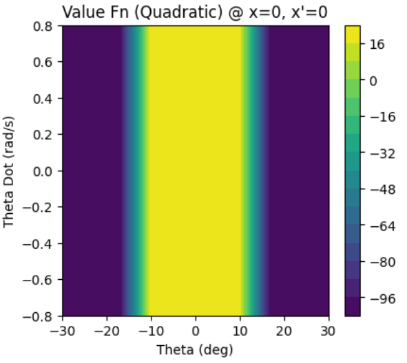
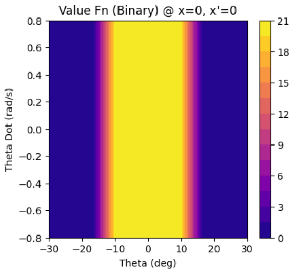

## Cart-Pole Control with Value Iteration & CUDA

### Overview

This project tackles the classic **Cart-Pole** control problem, a benchmark in reinforcement learning. The goal is to learn a policy that applies horizontal forces to a cart to keep a pole, hinged on top of it, balanced upright while keeping the cart within track limits.

This problem extends the Inverted Pendulum by adding two state dimensions (`cart position`, `cart velocity`), making it a 4-dimensional control task. The high dimensionality makes this a challenging problem for classic dynamic programming methods. Our approach relies on:
1.  **State Space Discretization:** The 4D continuous state space is discretized into a coarse grid (`10x10x10x10` levels).
2.  **GPU Acceleration:** To manage the 10,000-state grid, the Value Iteration algorithm is implemented in **CUDA** via Numba, where each state is updated in parallel on a GPU thread.

The project investigates the performance of both **Quadratic** and **Binary** reward functions in this higher-dimensional space and analyzes the significant impact of coarse discretization.

### Algorithm and Process

1.  **Environment Modeling**: A `CartPoleEnv` class simulates the complex, coupled dynamics of the cart and pole.

2.  **Discretization**: The 4D state space (`x`, `x_dot`, `theta`, `theta_dot`) is discretized according to the specified ranges and levels. This creates a 4D grid of 10,000 discrete states. The Value Function `V` and Policy `Pi` are stored as 4D arrays.

3.  **Value Iteration with CUDA**:
    *   Due to CUDA's 3D grid limitation, the 4D state space is "flattened" into a 1D array for GPU processing. Each GPU thread is assigned a unique linear index.
    *   The `vi_kernel_cartpole` CUDA kernel first decodes this linear index back into 4D grid coordinates (`ix, ixd, ith, ithd`).
    *   For each state, the kernel iterates through the two possible actions (Force = -10N, +10N), simulates the next state (`s'`), calculates the reward (`R`), and finds the value of the next state (`V(s')`).
    *   It updates the value of the current state using the Bellman equation: $V_{k+1}(s) = \max_a \left[ R(s,a) + \gamma V_k(s') \right]$.
    *   The solver runs this kernel iteratively until the Value Function stabilizes.

4.  **Policy Evaluation**: The final 4D Policy grid is used to control the agent in the continuous environment. The agent's continuous state is mapped to the nearest discrete grid cell to look up the optimal action. Performance is measured by the average number of time steps the system remains stable over 100 simulation runs.

### Results

The key finding of this experiment is that **the coarse state discretization was the dominant limiting factor**, leading to nearly identical, suboptimal performance for both reward functions.

*   **Average Survival (Quadratic):** 17.9 steps
*   **Average Survival (Binary):** 18.1 steps

The algorithm converged to a simple policy that focused exclusively on balancing the pole (`theta`) while ignoring the cart's position (`x`), causing it to eventually drive off the track.

#### Part (a): Quadratic Reward

**Value Function Slice (Quadratic) at x=0, x_dot=0**
*(The value function is high when the angle `theta` is near zero and drops off as it approaches the failure boundaries. The vertical structure shows its strong dependence on `theta` and weak dependence on `theta_dot`.)*

**Demonstration Video (Quadratic Policy)**
*(The video shows the agent successfully balancing the pole, but the cart drifts uncontrollably to one side until it hits the boundary and fails.)*

---

#### Part (b): Binary Reward

**Value Function Slice (Binary) at x=0, x_dot=0**
*(The value function is a flat plateau corresponding to the maximum expected reward (1/(1-gamma) ≈ 20) in the safe region. It drops off in a sharp "cliff" at the angular boundaries, again showing a primary dependence on `theta`.)*

**Demonstration Video (Binary Policy)**
*(The behavior is visually indistinguishable from the quadratic policy. The agent balances the pole effectively but drifts off the track, leading to the same failure mode.)*

### Discussion & Complexity

*   **Curse of Dimensionality:** The results are a classic example of the "Curse of Dimensionality." The 10x10x10x10 grid was too coarse to represent the complex relationships between all four state variables. The algorithm could only learn the most dominant feature of the problem: keeping `theta` small.

*   **Computational Feasibility:** The total number of states was 10,000. Value Iteration has a complexity of $O(|S| \cdot |A|)$ per iteration, meaning about 20,000 main operations. Doubling the resolution in each dimension would increase the state space by $2^4 = 16$ times to 160,000 states. While this would be slow for a CPU, it is entirely feasible with the CUDA implementation, which could likely find a much better policy with a finer grid.

In conclusion, this experiment highlights that in high-dimensional spaces, the quality of the state representation can be more critical than the specific formulation of the reward function.